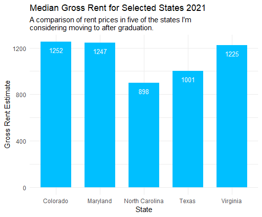
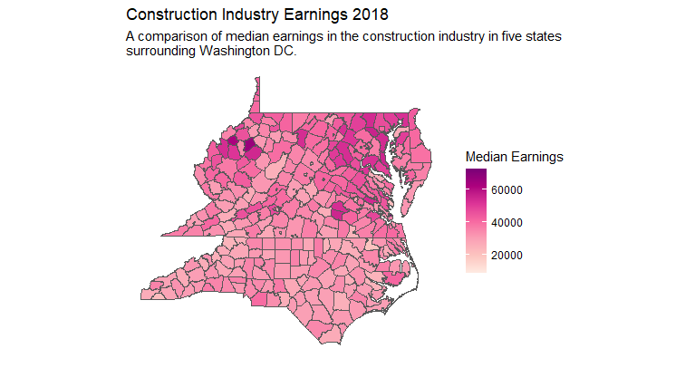
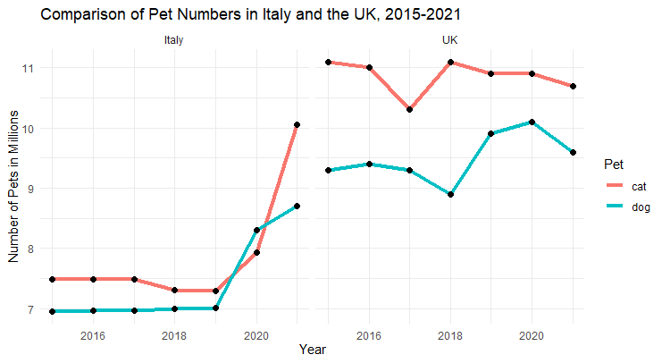

# Assignment 3

### Plotting Data using TidyCensus

Using the 2021 ACS, I pulled data from Table B25031_003 which contains median gross rent prices by the number of bedrooms, in this case one bedroom. I then narrowed the data by defining a new data frame with only data from five of the states I am looking into moving to after graduation. I plotted the data on a bar chart adding the median estimate value at the top of each bar and relevant titles.

### Mapping Data using TidyCensus

For this map I pulled data from the 2018 ACS Table B24031_005, which has median earning estimates based on industry, in this case I used construction. Again, I further narrowed down the data by defining the set of states I wanted data from, which were those surrounding Washington DC. I then mapped this data by county and added the necessary titles and labels.

### Plotting Excel Data using R

This plot combined data sourced from [FEDIAF](https://europeanpetfood.org/about/statistics/) and [PDSA](https://www.pdsa.org.uk/what-we-do/pdsa-animal-wellbeing-report/uk-pet-populations-of-dogs-cats-and-rabbits) on the number of cats and dogs owned by residents in Italy and the UK, which I combined into a single Excel file. After having R read the Excel file, I changed the character vectors to factors to aid in plotting the data. I then used a pipe function to group the data by animal before plotting it. I used a facet wrap to display the line plots for both countries side by side. 

