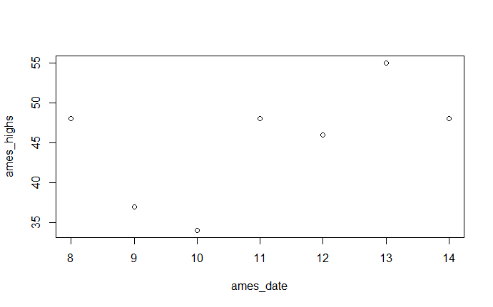
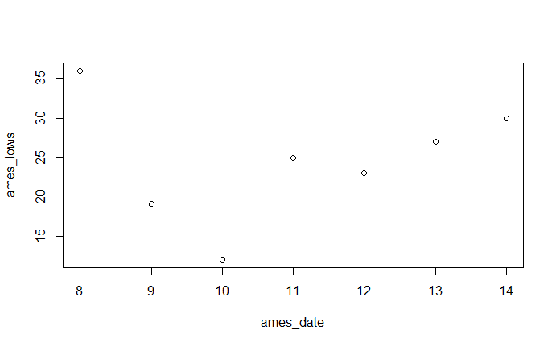

# Exercise 4a

In this exercise (my first attempt using R), I created three numeric vector sets in R to plot the daily high and low temperature data in Ames between the dates 2/8 - 2/14. 

For the daily highs plot, I created the vectors "ames_highs" for the temperatures and "ames_date" for the day. I then plotted the two vectors using "plot(ames_date, ames_highs)". Below is the resulting plot.

I did the same procedure for the daily lows plot, using "ames_lows" in place of "ames_highs".

