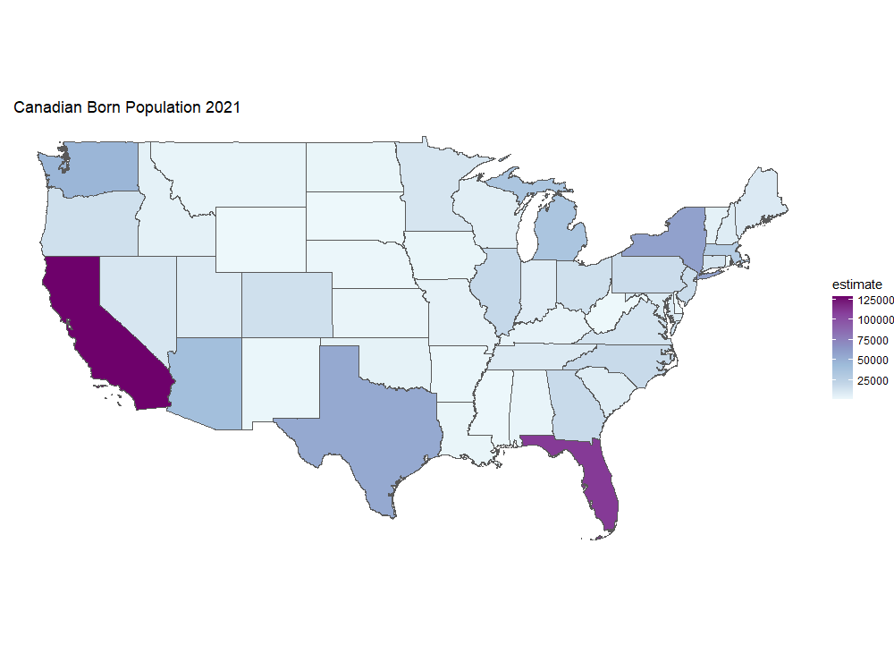

# Exercise 6a

In this exercise using R and TidyCensus, I pulled a dataset from the 2021 ACS5 on the estimated number of Canadian-born residents within each state (variable B05006_167). I filtered the data for the contiguous states while learning to plot the map.

